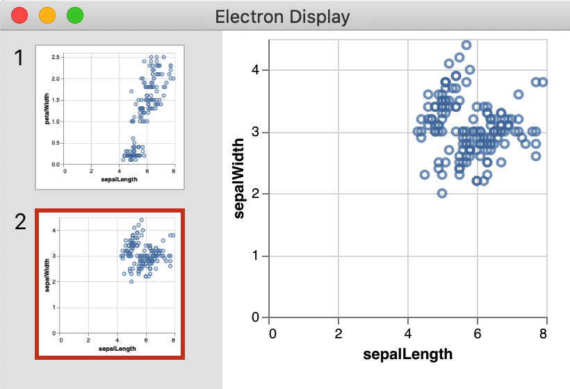

# ElectronDisplay

[](http://www.repostatus.org/#active)
[](https://travis-ci.org/queryverse/ElectronDisplay.jl)
[](https://ci.appveyor.com/project/queryverse/electrondisplay-jl/branch/master)
[](http://codecov.io/github/queryverse/ElectronDisplay.jl?branch=master)

## Overview



This package provides a display for figures, plots and tables. When you load the package, it will push a new display onto the julia display stack and from then on it will display any value that can be rendered as png, svg, vega, vega-lite or plotly in an electron based window. This is especially handy when one works on the REPL and wants plots or tables to show up in a nice window.

<br clear="all"/>

## Getting Started

You can install the package via the normal julia package manager:

````julia
using Pkg; Pkg.add("ElectronDisplay")
````

As soon as you load the package with ``using ElectronDisplay``, it will start to show plots that have the correct ``show`` methods in an electron window.

`ElectronDisplay` also exports a function `electrondisplay`.  You can use `electrondisplay(x)` to show `x` explicitly in `ElectronDisplay` (e.g., when another display has higher precedence).  You can also use `electrondisplay(mime, x)` to specify a MIME to be used.  For example, to read the docstring of `reduce` in `ElectronDisplay`, you can use `electrondisplay(@doc reduce)`.

See the original [announcement](https://www.queryverse.org/2019/02/13/electrondisplay/) for a quick start guide.

## Configuration

You can use the following configuration option to reuse existing window for displaying a new content.  The default behavior is to create a new window for each display.

````julia
using ElectronDisplay
ElectronDisplay.CONFIG.single_window = true
````

To control objects to be handled by `ElectronDisplay`, you can set `ElectronDisplay.CONFIG.showable`.  By default, `ElectronDisplay` does not show markdown, HTML, and `application/vnd.dataresource+json` output.  To show everything in `ElectronDisplay` whenever it's supported, you can use:

````julia
ElectronDisplay.CONFIG.showable = showable
````

To override the default configuration temporary, use the keyword arguments to `electrondisplay`:

````julia
electrondisplay(@doc reduce; single_window=true, focus=false)
````
